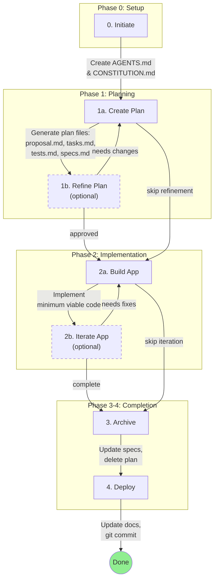

# Agentic Coding Framework

A structured framework for AI-assisted software development. This framework enforces a consistent workflow where changes are planned, implemented, tested, and documented through a series of defined phases.

## Table of Contents

- [Core Concepts](#core-concepts)
- [Directory Structure](#directory-structure)
- [Workflow Overview](#workflow-overview)
- [Phase Details](#phase-details)
- [Template System](#template-system)
- [Naming Conventions](#naming-conventions)
- [File Purposes](#file-purposes)
- [Quick Reference](#quick-reference)

---

## Core Concepts

### Plans vs Specs

- **Plans** (in `plans/`): Temporary working documents for active development. Each plan has a proposal, tasks, tests, and affected specs. Plans are deleted after archiving.
- **Specs** (in `specs/`): Permanent canonical specifications. These are the single source of truth for system requirements and behavior. Specs are updated based on completed plans.

### Key Principles

1. **Specs are the source of truth** - All requirements live in spec files
2. **Plans link to specs** - Every change must document which specs it affects
3. **Iterative refinement** - Plans can be refined before implementation
4. **Minimal implementation** - Write only what's needed to satisfy acceptance criteria
5. **No scope creep** - Do not add features beyond the plan

---

## Directory Structure

```
.agentic/
├── plans/                    # Active plans (temporary, deleted after archive)
│   └── <plan-name>/            # One directory per plan
│       ├── proposal.md         # Objective, description, acceptance criteria (non-technical)
│       ├── tasks.md            # Implementation steps (technical)
│       ├── tests.md            # Test plan
│       └── specs.md            # List of affected specifications
│
├── specs/                      # Canonical specifications (permanent)
│   └── <spec-name>/            # One directory per spec
│       ├── spec.md             # Purpose, requirements, constraints
│       └── changelog.md        # History of changes
│
├── memories/                   # AI memory and rules
│   ├── CONSTITUTION.md         # Rules AI must ALWAYS follow
│   └── <name>.md               # Additional context files
│
├── templates/                  # Handlebars templates
│   ├── plans/                # Templates for plan files
│   │   ├── proposal.md.hbs
│   │   ├── tasks.md.hbs
│   │   ├── tests.md.hbs
│   │   └── specs.md.hbs
│   └── specs/                  # Templates for spec files
│       ├── spec.md.hbs
│       └── changelog.md.hbs
│
└── README.md                   # This file
```

---

## Workflow Overview



### Workflow Summary

| Step | Action | Output |
|------|--------|--------|
| 0 → 1a | Initialize framework | `AGENTS.md`, `CONSTITUTION.md` |
| 1a → 1b/2a | Create plan | `proposal.md`, `tasks.md`, `tests.md`, `specs.md` |
| 1b → 1a | Refine (loop) | Updated plan files |
| 2a → 2b/3 | Build code | Working implementation |
| 2b → 2a | Iterate (loop) | Fixed/improved code |
| 3 → 4 | Archive | Updated specs, deleted plan |
| 4 → Done | Deploy | Git commit |

### Commands

| Phase | Command | Required | Description |
|-------|---------|----------|-------------|
| 0 | `/agentic.0.initiate <text>` | Yes | Initialize the framework |
| 1a | `/agentic.1-a.create-plan <text>` | Yes | Create a new plan |
| 1b | `/agentic.1-b.refine-plan <text>` | No | Refine plan until approved |
| 2a | `/agentic.2-a.build-app [plan]` | Yes | Implement the plan |
| 2b | `/agentic.2-b.iterate-app <text>` | No | Iterate on implementation |
| 3 | `/agentic.3.archive [plan]` | Yes | Archive plan and update specs |
| 4 | `/agentic.4.deploy` | Yes | Update docs and commit |

---

## Phase Details

### Phase 0: Initiate

**Purpose:** Initialize the agentic framework in a repository.

**Prerequisites:**
- Git must be initialized (`.git/` exists)
- If `AGENTS.md` or `CONSTITUTION.md` exist, confirm before overwriting

**Actions:**
1. Analyze repository (read README, config files)
2. Create/update `CONSTITUTION.md` with project rules
3. Create `AGENTS.md` in repository root

**Outputs:**
- `.agentic/memories/CONSTITUTION.md`
- `AGENTS.md`

**Rules:**
- Do NOT write any code in this phase
- Ask questions if project context is unclear

---

### Phase 1a: Create Plan

**Purpose:** Create a structured plan for a change request.

**Prerequisites:**
- `.agentic/memories/` and `.agentic/templates/plans/` must exist
- User input must be clear enough to understand scope

**Actions:**
1. Read all files in `.agentic/memories/`
2. Read all templates in `.agentic/templates/plans/`
3. Generate plan name (max 6 words, dash-separated)
4. Create `.agentic/plans/<name>/` directory
5. Render templates to create plan files

**Outputs:**
- `.agentic/plans/<name>/proposal.md`
- `.agentic/plans/<name>/tasks.md`
- `.agentic/plans/<name>/tests.md`
- `.agentic/plans/<name>/specs.md`

**Rules:**
- `proposal.md` is NON-TECHNICAL (what, not how)
- `tasks.md` is TECHNICAL (how to implement)
- All four files must use the same `name` value
- Ask clarifying questions if request is ambiguous

---

### Phase 1b: Refine Plan (Optional)

**Purpose:** Iterate on plan documents until they meet expectations.

**When to use:** When the plan from 1a needs adjustments.

**When to skip:** When the plan from 1a already meets expectations.

**Prerequisites:**
- Plan must exist in `.agentic/plans/`
- User feedback must be clear

**Actions:**
1. Read all files in `.agentic/memories/`
2. Read current plan files
3. Analyze user feedback
4. Update affected files
5. Present summary of changes
6. Repeat until user approves

**Revision Checklist:**
- [ ] All files use the same plan name
- [ ] No placeholder text or TODOs remain
- [ ] Requirements are specific and measurable
- [ ] Tasks are actionable and well-defined
- [ ] Each criterion has a corresponding test

**Rules:**
- Do NOT write any implementation code
- Do NOT modify files outside the plan directory
- Keep all four plan files in sync
- Always summarize changes and ask for confirmation

---

### Phase 2a: Build App

**Purpose:** Implement minimum viable code for a plan.

**Prerequisites:**
- Valid plan must exist in `.agentic/plans/`
- If multiple plans exist, user must specify which one

**Actions:**
1. Read all files in `.agentic/memories/`
2. Read the complete plan
3. Implement code following `tasks.md`
4. Create tests based on `tests.md`
5. Mark completed steps with `[x]` in `tasks.md`
6. Verify all acceptance criteria are met

**Progress Tracking Format:**
```markdown
## Prerequisites
- [x] Database connection is configured
- [ ] Environment variables set

## Implementation Steps
### Step 0: Create User Model
- [x] Completed
```

**Rules:**
- Follow existing code patterns
- Write MINIMAL code - only what's needed
- Do NOT modify specs (that happens in archive phase)
- Do NOT add features beyond plan scope
- Do NOT refactor unrelated code

---

### Phase 2b: Iterate App (Optional)

**Purpose:** Iterate on implementation based on feedback.

**When to use:** When implementation needs bug fixes or adjustments.

**When to skip:** When implementation from 2a already works correctly.

**Prerequisites:**
- Active plan with in-progress tasks
- Clear feedback from user

**Scope Check:**
- **Within original plan** → Proceed with changes
- **Beyond original scope** → Suggest creating a new plan

**When to Suggest New Plan:**
- Feedback introduces entirely new features
- Requires architectural changes beyond the plan
- Would significantly delay current plan
- Conflicts with original acceptance criteria

**Rules:**
- Keep changes focused on the feedback
- Do NOT scope-creep beyond the original plan
- Run tests after changes to verify no regressions

---

### Phase 3: Archive

**Purpose:** Archive completed plan and update specifications.

**Prerequisites:**
- Plan must be COMPLETE (all criteria met, all tests pass, all tasks done)
- Plan must contain all four files

**Completion Verification:**
- [ ] All acceptance criteria in `proposal.md` are checked
- [ ] All tests in `tests.md` pass
- [ ] All steps in `tasks.md` are marked `[x]`
- [ ] Code has been reviewed (if applicable)

**Actions:**
1. Read all files in `.agentic/memories/`
2. Read all templates in `.agentic/templates/specs/`
3. Verify plan completion
4. Read `specs.md` to identify affected specs
5. Update existing specs in `.agentic/specs/`
6. Create new specs if needed
7. Add changelog entries
8. Ask for confirmation
9. Delete plan directory

**Spec Update Types:**
- **Update** - Modify existing content
- **Extend** - Add new sections or items
- **Revise** - Rewrite sections significantly

**Changelog Entry Format:**
```markdown
## <plan-name>

### Changed
- Description of what changed

### Added
- Description of what was added
```

**Rules:**
- NEVER archive incomplete plans
- Preserve spec history in `changelog.md`
- Ask for confirmation before deleting plan directory

---

### Phase 4: Deploy

**Purpose:** Update documentation and create git commit.

**Prerequisites:**
- All tests must pass
- No sensitive data in staged files

**Actions:**
1. Read all files in `.agentic/memories/`
2. Review git status and diff
3. Identify documentation that needs updates
4. Update documentation
5. Stage changes selectively
6. Create commit with proper message

**Documentation Update Triggers:**
| Update | When |
|--------|------|
| README.md | API changed, usage changed, installation changed, CLI changed |
| docs/ | Detailed API changes, new guides needed, architecture affected |
| CHANGELOG.md | If project maintains a changelog |

**Documentation Should NOT be Updated:**
- Internal refactoring with no external impact
- Bug fixes that don't change expected behavior
- Test-only changes
- Code style or formatting changes

**Commit Message Format:**
```
<type>: <short summary>

<optional body explaining what and why>

Plan: <plan-name>

Co-Authored-By: Claude <noreply@anthropic.com>
```

Types: `feat`, `fix`, `docs`, `refactor`, `test`, `chore`

**Rules:**
- Do NOT push to remote unless explicitly requested
- Stage files selectively (avoid `git add .`)
- Always include "Co-Authored-By" attribution

---

## Template System

Templates use Handlebars syntax (`.hbs` files). AI must render templates to plain markdown.

### Handlebars Syntax

| Syntax | Description |
|--------|-------------|
| `{{variable}}` | Replace with value |
| `{{#each array}}...{{/each}}` | Loop over items |
| `{{this}}` | Current item in loop |
| `{{@index}}` | Current index (0-based) |
| `{{#if condition}}...{{/if}}` | Conditional block |

### Template Variables

#### proposal.md.hbs

| Variable | Type | Required | Description |
|----------|------|----------|-------------|
| `name` | string | Yes | Plan name, dash-separated |
| `objective` | string | Yes | One-sentence goal |
| `description` | string | Yes | User-focused explanation (non-technical) |
| `criteria` | string[] | Yes | Measurable acceptance criteria |
| `out_of_scope` | string | No | What this plan will NOT do |
| `references` | object[] | No | Links with `title` and `url` |

#### tasks.md.hbs

| Variable | Type | Required | Description |
|----------|------|----------|-------------|
| `name` | string | Yes | Same as proposal |
| `prerequisites` | string[] | No | Pre-conditions to verify |
| `steps` | object[] | Yes | Steps with `title`, `description`, `files`, `changes` |
| `verification` | string[] | Yes | Final checks |

#### tests.md.hbs

| Variable | Type | Required | Description |
|----------|------|----------|-------------|
| `name` | string | Yes | Same as proposal |
| `unit_tests` | string[] | No | Function/component tests |
| `integration_tests` | string[] | No | Component interaction tests |
| `e2e_tests` | string[] | No | Full flow tests |
| `manual_tests` | string[] | No | Manual verification steps |
| `edge_cases` | string[] | No | Boundary conditions |
| `commands` | object[] | No | Commands with `description` and `command` |

#### specs.md.hbs

| Variable | Type | Required | Description |
|----------|------|----------|-------------|
| `name` | string | Yes | Same as proposal |
| `modified_specs` | object[] | No | Specs with `name`, `slug`, `change_type`, `description` |
| `new_specs` | object[] | No | New specs with `name`, `purpose` |
| `deprecated_specs` | object[] | No | Specs with `name`, `reason`, `replacement` |
| `no_changes` | object[] | No | Unaffected specs with `name`, `reason` |

#### spec.md.hbs

| Variable | Type | Required | Description |
|----------|------|----------|-------------|
| `name` | string | Yes | Spec name |
| `purpose` | string | Yes | One-sentence purpose |
| `constraints` | string[] | No | Constraints or limitations |
| `examples` | object[] | No | Examples with `language` and `code` |
| `notes` | string | No | Additional notes |

#### changelog.md.hbs

| Variable | Type | Required | Description |
|----------|------|----------|-------------|
| `name` | string | Yes | Spec name |
| `versions` | object[] | No | Entries with `version`, `added`, `changed`, `deprecated`, `removed`, `fixed` |

---

## Naming Conventions

| Type | Max Words | Format | Examples |
|------|-----------|--------|----------|
| Plan | 6 | lowercase, dash-separated | `add-user-auth`, `fix-login-bug`, `update-api-endpoints` |
| Spec | 4 | lowercase, dash-separated, with category prefix | `tech-database`, `biz-user-auth` |

### Spec Category Prefixes

Specs must use a category prefix to indicate their domain:

| Prefix | Category | Description | Examples |
|--------|----------|-------------|----------|
| `tech-` | Technical | Infrastructure, architecture, techstack, database, APIs, deployment | `tech-database`, `tech-api-routes`, `tech-infra`, `tech-caching` |
| `biz-` | Business | UI/UX design, business logic, user flows, domain rules, features | `biz-user-auth`, `biz-checkout-flow`, `biz-pricing-rules` |

**Guidelines for choosing the prefix:**

- **Use `tech-`** for specs about:
  - Database schemas, queries, migrations
  - API endpoints, protocols, data formats
  - Infrastructure (servers, containers, cloud services)
  - Tech stack decisions (frameworks, libraries, tools)
  - Performance, caching, optimization
  - Security implementation details
  - DevOps, CI/CD, deployment

- **Use `biz-`** for specs about:
  - User interface design and layouts
  - Business rules and logic
  - User workflows and journeys
  - Feature requirements
  - Domain models (conceptual, not database)
  - Validation rules (business-level)
  - Content and copy requirements

---

## File Purposes

### Plan Files (in `plans/<name>/`)

| File | Purpose | Technical? |
|------|---------|------------|
| `proposal.md` | WHAT to build - objective, criteria, scope | No |
| `tasks.md` | HOW to build - implementation steps, files | Yes |
| `tests.md` | HOW to verify - test plan, edge cases | Yes |
| `specs.md` | WHAT affects - list of affected specifications | No |

### Spec Files (in `specs/<name>/`)

| File | Purpose |
|------|---------|
| `spec.md` | Canonical definition - purpose, requirements, constraints |
| `changelog.md` | History - all changes to this spec |

### Memory Files (in `memories/`)

| File | Purpose |
|------|---------|
| `CONSTITUTION.md` | Rules AI must ALWAYS follow (code style, testing, security) |
| `<name>.md` | Additional context (domain knowledge, decisions) |

---

## Quick Reference

### Before Starting Any Phase

1. Read all files in `.agentic/memories/`
2. Check prerequisites for the phase
3. Ask clarifying questions if needed

### Phase Decision Tree

```
User wants to start new work?
  └─→ Is framework initialized?
        ├─ No → Run Phase 0 (Initiate)
        └─ Yes → Run Phase 1a (Create Plan)

User wants to adjust plan?
  └─→ Run Phase 1b (Refine Plan)

User wants to implement?
  └─→ Is there an approved plan?
        ├─ No → Run Phase 1a first
        └─ Yes → Run Phase 2a (Build App)

User reports bugs or wants adjustments?
  └─→ Is this within scope?
        ├─ No → Suggest new plan
        └─ Yes → Run Phase 2b (Iterate App)

User says implementation is complete?
  └─→ Are all criteria met?
        ├─ No → Continue Phase 2a/2b
        └─ Yes → Run Phase 3 (Archive)

User wants to commit?
  └─→ Run Phase 4 (Deploy)
```

### Common Mistakes to Avoid

1. **Writing code during planning phases** - Phases 0, 1a, 1b are documentation only
2. **Modifying specs during build** - Specs are only updated in Phase 3
3. **Archiving incomplete plans** - All criteria must be met first
4. **Scope creep** - Stay within the plan boundaries
5. **Skipping memory files** - Always read `CONSTITUTION.md` first
6. **Forgetting to track progress** - Update `tasks.md` checkboxes during build
7. **Pushing without permission** - Phase 4 commits locally; push only if requested

### Checklist for AI

Before each phase:
- [ ] Read all files in `.agentic/memories/`
- [ ] Verify prerequisites for the phase
- [ ] Confirm user intent if ambiguous

During planning (1a, 1b):
- [ ] Keep `proposal.md` non-technical
- [ ] Keep `tasks.md` technical
- [ ] Ensure all files use same plan name
- [ ] Link to existing specs in `specs.md`

During building (2a, 2b):
- [ ] Follow existing code patterns
- [ ] Write minimal code
- [ ] Update `tasks.md` checkboxes
- [ ] Run tests frequently

During archive (3):
- [ ] Verify ALL completion criteria
- [ ] Update affected specs
- [ ] Add changelog entries
- [ ] Confirm before deleting plan

During deploy (4):
- [ ] Update only necessary documentation
- [ ] Stage files selectively
- [ ] Include proper commit message format
- [ ] Do NOT push unless requested
