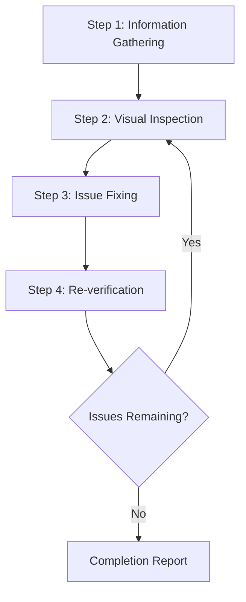
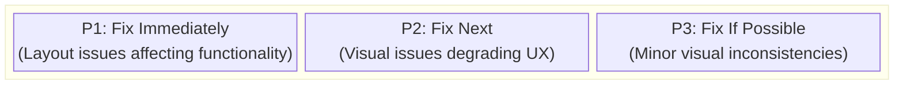
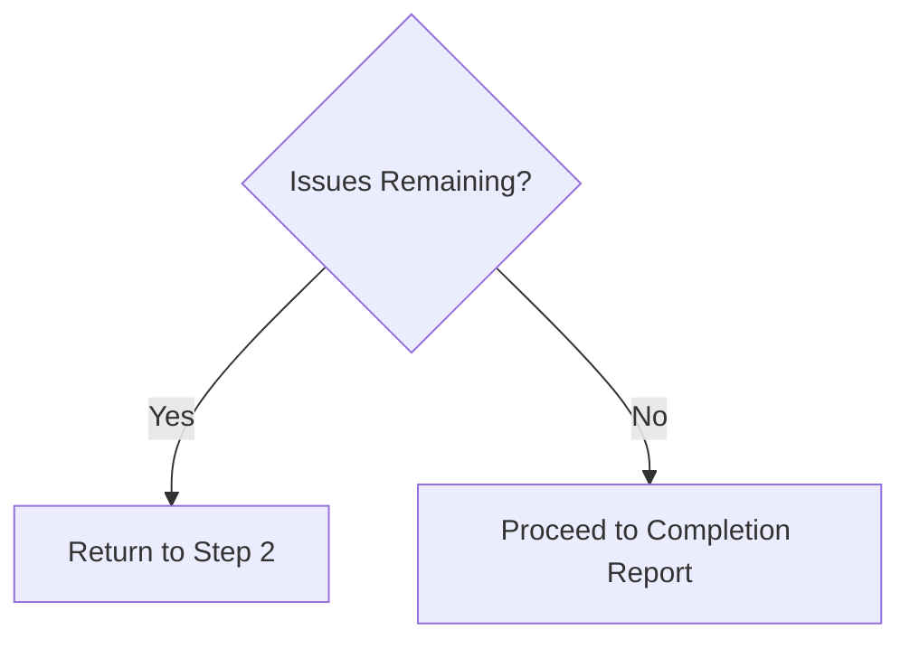

# Web Design Reviewer

This skill enables visual inspection and validation of website design quality for the **MoneyWiz Visualization** application, identifying and fixing issues at the source code level.

## MoneyWiz Project Context

- **Framework:** SvelteKit with Svelte 5 components
- **Styling System:** Tailwind CSS v4
- **Language:** TypeScript
- **Components:** AppHeader, MoneyLogo, CsvUploadButton, SummaryCards, TopCategoriesChart, DailyExpensesChart, IncomeExpenseRatioChart
- **Dev Server:** http://localhost:5173/
- **Package Manager:** Bun
- **Source Structure:** `src/components/` for UI, `src/lib/` for logic, `src/routes/` for pages

## Scope of Application

- **MoneyWiz Dashboard** - Main visualization page with charts and CSV upload
- **Responsive Design** - Mobile (375px), Tablet (768px), Desktop (1280px), Wide (1920px)
- **Component Styling** - Tailwind CSS classes and responsive utilities
- **Chart Appearance** - Data visualization layout, legend positioning, colors
- **Accessibility** - Focus states, color contrast, ARIA labels

## Prerequisites

### Required

1. **Target website must be running**
   - Local development server (e.g., `http://localhost:3000`)
   - Staging environment
   - Production environment (for read-only reviews)

2. **Browser automation must be available**
   - Screenshot capture
   - Page navigation
   - DOM information retrieval

3. **Access to source code (when making fixes)**
   - Project must exist within the workspace

## Workflow Overview



---

## Step 1: Information Gathering Phase

### 1.1 URL Confirmation

If the URL is not provided, ask the user:

> Please provide the URL of the website to review (e.g., `http://localhost:3000`)

### 1.2 Understanding Project Structure

When making fixes, gather the following information:

| Item            | Example Question                              |
| --------------- | --------------------------------------------- |
| Framework       | Are you using React / Vue / Next.js, etc.?    |
| Styling Method  | CSS / SCSS / Tailwind / CSS-in-JS, etc.       |
| Source Location | Where are style files and components located? |
| Review Scope    | Specific pages only or entire site?           |

### 1.3 Automatic Project Detection - MoneyWiz

Automatically detected for this project:

```
Detection targets:
├── package.json     → SvelteKit + Tailwind CSS (confirmed)
├── tsconfig.json    → TypeScript (confirmed)
├── tailwind.config  → Tailwind CSS v4 (confirmed)
├── vite.config.ts   → Vite build system (confirmed)
├── svelte.config.js → SvelteKit routing & adapters
└── src/
    ├── components/  → Svelte components
    ├── lib/         → TypeScript utilities
    └── routes/      → SvelteKit file-based routing
```

### 1.4 Styling Method - MoneyWiz Uses Tailwind CSS

**MoneyWiz uses Tailwind CSS v4** exclusively:

| Item                    | Value                                  |
| ----------------------- | -------------------------------------- |
| Styling System          | Tailwind CSS v4                        |
| Config File             | `tailwind.config.js` (or TypeScript)   |
| Component Styling       | `class` attributes in `.svelte` files |
| Global Styles           | `src/routes/layout.css` (Tailwind)    |
| Build Integration       | @tailwindcss/vite plugin               |
| Responsive Prefixes     | `sm:`, `md:`, `lg:`, `xl:` (standard) |
| Hover/Focus States      | `hover:`, `focus:`, etc.               |
| Dark Mode               | Configured in tailwind.config.js       |

**Editing Targets:**
- Svelte components: `src/components/*.svelte` - update `class=` attributes
- Route pages: `src/routes/*.svelte` - update styling classes
- Global styles: `src/routes/layout.css` - Tailwind directives

---

## Step 2: Visual Inspection Phase

### 2.1 MoneyWiz Page Traversal

1. **Start at Dashboard:** `http://localhost:5173/`
2. **Verify Header:** AppHeader with MoneyLogo and Clear button
3. **Test CSV Upload:** Upload functionality via CsvUploadButton
4. **Visualize Data:** Charts render correctly (TopCategoriesChart, DailyExpensesChart, IncomeExpenseRatioChart)
5. **Check Summary:** Summary cards display correct values
6. **Responsive Test:** Verify layout at all breakpoints

**Elements to Check:**
- AppHeader component layout
- CSV upload input and button
- Chart containers and legends
- Summary cards alignment
- Mobile menu (if applicable)
- Accessibility features (focus states, labels)

### 2.2 MoneyWiz Component Inspection Items

**Key Components to Verify:**
- **AppHeader.svelte** - Navigation, logo, clear button layout
- **MoneyLogo.svelte** - Logo rendering and sizing
- **CsvUploadButton.svelte** - Upload input accessibility and styling
- **SummaryCards.svelte** - Card grid layout, value alignment, currency display
- **TopCategoriesChart.svelte** - Chart rendering, legend positioning
- **DailyExpensesChart.svelte** - Timeline chart, axis labels
- **IncomeExpenseRatioChart.svelte** - Donut chart, savings rate indicator

### 2.3 Inspection Items

#### Layout Issues

| Issue                | Description                                       | Severity |
| -------------------- | ------------------------------------------------- | -------- |
| Element Overflow     | Content overflows from parent element or viewport | High     |
| Element Overlap      | Unintended overlapping of elements                | High     |
| Alignment Issues     | Grid or flex alignment problems                   | Medium   |
| Inconsistent Spacing | Padding/margin inconsistencies                    | Medium   |
| Text Clipping        | Long text not handled properly                    | Medium   |

#### Responsive Issues

| Issue               | Description                                    | Severity |
| ------------------- | ---------------------------------------------- | -------- |
| Non-mobile Friendly | Layout breaks on small screens                 | High     |
| Breakpoint Issues   | Unnatural transitions when screen size changes | Medium   |
| Touch Targets       | Buttons too small on mobile                    | Medium   |

#### Accessibility Issues

| Issue                 | Description                                       | Severity |
| --------------------- | ------------------------------------------------- | -------- |
| Insufficient Contrast | Low contrast ratio between text and background    | High     |
| No Focus State        | Cannot determine state during keyboard navigation | High     |
| Missing alt Text      | No alternative text for images                    | Medium   |

#### Visual Consistency

| Issue                 | Description                                  | Severity |
| --------------------- | -------------------------------------------- | -------- |
| Font Inconsistency    | Mixed font families                          | Medium   |
| Color Inconsistency   | Non-unified brand colors                     | Medium   |
| Spacing Inconsistency | Non-uniform spacing between similar elements | Low      |

### 2.3 Viewport Testing (Responsive)

Test at the following viewports:

| Name    | Width  | Representative Device |
| ------- | ------ | --------------------- |
| Mobile  | 375px  | iPhone SE/12 mini     |
| Tablet  | 768px  | iPad                  |
| Desktop | 1280px | Standard PC           |
| Wide    | 1920px | Large display         |

---

## Step 3: Issue Fixing Phase

### 3.1 Issue Prioritization



### 3.2 Identifying Source Files

Identify source files from problematic elements:

1. **Selector-based Search**
   - Search codebase by class name or ID
   - Explore style definitions with `grep_search`

2. **Component-based Search**
   - Identify components from element text or structure
   - Explore related files with `semantic_search`

3. **File Pattern Filtering**
   ```
   Style files: src/**/*.css, styles/**/*
   Components: src/components/**/*
   Pages: src/pages/**, app/**
   ```

### 3.3 Applying Fixes

#### Framework-specific Fix Guidelines for SvelteKit

**Svelte Component Styling (`.svelte` files):**
```svelte
<script lang="ts">
  let className = 'text-lg font-bold';
</script>

<div class="{className}">
  <!-- content -->
</div>

<style>
  /* Scoped CSS (optional - usually use Tailwind instead) */
  :global(.custom-class) { /* ... */ }
</style>
```

**Tailwind CSS Classes:**
- Use responsive prefixes: `md:flex`, `lg:grid-cols-3`
- Hover/focus: `hover:bg-blue-600`, `focus:ring-2`
- Use `@apply` in `layout.css` for common patterns
- Reference: [references/framework-fixes.md](references/framework-fixes.md) for SvelteKit-specific patterns

#### Fix Principles for MoneyWiz

1. **Minimal Changes**: Update only the affected component's `class` attributes
2. **Respect Existing Patterns**: 
   - Use Tailwind CSS classes (never add inline styles)
   - Follow responsive-first design (mobile → tablet → desktop)
   - Match existing component spacing (consistent padding/margin)
3. **Avoid Breaking Changes**: 
   - Test all chart components after changes
   - Verify responsive behavior at all breakpoints
   - Check that data visualizations still render correctly
4. **TypeScript Best Practices**: 
   - Maintain type safety in component props
   - Use `lang="ts"` in script tags
5. **Svelte 5 Syntax**: 
   - Use event attributes: `onchange`, `onclick` (not `on:change`)
   - Use `$derived()` for reactive values
   - Use `$effect()` for side effects

---

## Step 4: Re-verification Phase

### 4.1 Post-fix Confirmation

1. Reload browser (or wait for development server HMR)
2. Capture screenshots of fixed areas
3. Compare before and after

### 4.2 Regression Testing

- Verify that fixes haven't affected other areas
- Confirm responsive display is not broken

### 4.3 Iteration Decision



**Iteration Limit**: If more than 3 fix attempts are needed for a specific issue, consult the user

---

## Output Format

### Review Results Report

```markdown
# Web Design Review Results

## Summary

| Item             | Value                   |
| ---------------- | ----------------------- |
| Target URL       | {URL}                   |
| Framework        | {Detected framework}    |
| Styling          | {CSS / Tailwind / etc.} |
| Tested Viewports | Desktop, Mobile         |
| Issues Detected  | {N}                     |
| Issues Fixed     | {M}                     |

## Detected Issues

### [P1] {Issue Title}

- **Page**: {Page path}
- **Element**: {Selector or description}
- **Issue**: {Detailed description of the issue}
- **Fixed File**: `{File path}`
- **Fix Details**: {Description of changes}
- **Screenshot**: Before/After

### [P2] {Issue Title}

...

## Unfixed Issues (if any)

### {Issue Title}

- **Reason**: {Why it was not fixed/could not be fixed}
- **Recommended Action**: {Recommendations for user}

## Recommendations

- {Suggestions for future improvements}
```

---

## Required Capabilities

| Capability          | Description                     | Required           |
| ------------------- | ------------------------------- | ------------------ |
| Web Page Navigation | Access URLs, page transitions   | ✅                 |
| Screenshot Capture  | Page image capture              | ✅                 |
| Image Analysis      | Visual issue detection          | ✅                 |
| DOM Retrieval       | Page structure retrieval        | Recommended        |
| File Read/Write     | Source code reading and editing | Required for fixes |
| Code Search         | Code search within project      | Required for fixes |

---

## Reference Implementation

### Implementation with Playwright MCP

[Playwright MCP](https://github.com/microsoft/playwright-mcp) is recommended as the reference implementation for this skill.

| Capability | Playwright MCP Tool        | Purpose                            |
| ---------- | -------------------------- | ---------------------------------- |
| Navigation | `browser_navigate`         | Access URLs                        |
| Snapshot   | `browser_snapshot`         | Retrieve DOM structure             |
| Screenshot | `browser_take_screenshot`  | Images for visual inspection       |
| Click      | `browser_click`            | Interact with interactive elements |
| Resize     | `browser_resize`           | Responsive testing                 |
| Console    | `browser_console_messages` | Detect JS errors                   |

#### Configuration Example (MCP Server)

```json
{
  "mcpServers": {
    "playwright": {
      "command": "npx",
      "args": ["-y", "@playwright/mcp@latest", "--caps=vision"]
    }
  }
}
```

### Other Compatible Browser Automation Tools

| Tool           | Features                                      |
| -------------- | --------------------------------------------- |
| Selenium       | Broad browser support, multi-language support |
| Puppeteer      | Chrome/Chromium focused, Node.js              |
| Cypress        | Easy integration with E2E testing             |
| WebDriver BiDi | Standardized next-generation protocol         |

The same workflow can be implemented with these tools. As long as they provide the necessary capabilities (navigation, screenshot, DOM retrieval), the choice of tool is flexible.

---

## Best Practices

### DO (Recommended)

- ✅ Always save screenshots before making fixes
- ✅ Fix one issue at a time and verify each
- ✅ Follow the project's existing code style
- ✅ Confirm with user before major changes
- ✅ Document fix details thoroughly

### DON'T (Not Recommended)

- ❌ Large-scale refactoring without confirmation
- ❌ Ignoring design systems or brand guidelines
- ❌ Fixes that ignore performance
- ❌ Fixing multiple issues at once (difficult to verify)

---

## Troubleshooting

### Problem: Style files not found

1. Check dependencies in `package.json`
2. Consider the possibility of CSS-in-JS
3. Consider CSS generated at build time
4. Ask user about styling method

### Problem: Fixes not reflected

1. Check if development server HMR is working
2. Clear browser cache
3. Rebuild if project requires build
4. Check CSS specificity issues

### Problem: Fixes affecting other areas

1. Rollback changes
2. Use more specific selectors
3. Consider using CSS Modules or scoped styles
4. Consult user to confirm impact scope
