# iPad MoneyWiz SQLite Schema Diagram

Source: local MoneyWiz SQLite export (private, not committed to repository).
Generated from live table metadata on 2026-02-11.

## Notes

- This is a Core Data style database.
- `Z_PRIMARYKEY` maps entity ids (`Z_ENT`) to logical model names.
- Most relationships are not declared as SQLite foreign keys.
- `ZSYNCOBJECT` is a polymorphic table (329 columns) that stores many
  entity subtypes (Account, Budget, Category, Transaction, Tag, etc.).
- Relationship labels below are inferred from column names and
  `Z_PRIMARYKEY` entity mappings.
- The source database is intentionally outside `static/database/` because
  that folder is gitignored and unavailable in CI.

## Mermaid ER Diagram

```mermaid
erDiagram
  Z_PRIMARYKEY {
    INTEGER Z_ENT PK
    VARCHAR Z_NAME
    INTEGER Z_SUPER
    INTEGER Z_MAX
  }

  ZSYNCOBJECT {
    INTEGER Z_PK PK
    INTEGER Z_ENT
    INTEGER Z_OPT
    VARCHAR ZGID
    VARCHAR ZNAME
    FLOAT ZBALANCE
    TIMESTAMP ZDATE
    VARCHAR Z__MANY_OTHER_COLUMNS
  }

  ZACCOUNTBUDGETLINK {
    INTEGER Z_PK PK
    INTEGER Z_ENT
    INTEGER ZACCOUNT
    INTEGER Z9_ACCOUNT
    INTEGER ZBUDGET
  }

  ZCATEGORYASSIGMENT {
    INTEGER Z_PK PK
    INTEGER Z_ENT
    INTEGER ZBUDGET
    INTEGER ZCATEGORY
    INTEGER ZSCHEDULEDTRANSACITION
    INTEGER Z31_SCHEDULEDTRANSACITION
    INTEGER ZSTRINGHISTORYITEM
    INTEGER ZTRANSACTION
    INTEGER Z36_TRANSACTION
    FLOAT ZAMOUNT
  }

  ZCOMMONSETTINGS {
    INTEGER Z_PK PK
    INTEGER Z_ENT
    INTEGER ZCURRENTUSER
  }

  ZIMAGE {
    INTEGER Z_PK PK
    INTEGER Z_ENT
    INTEGER ZTRANSACTION
    INTEGER Z36_TRANSACTION
    VARCHAR ZIMAGEURLSTR
  }

  ZINVESTMENTACCOUNTTOTALVALUE {
    INTEGER Z_PK PK
    INTEGER Z_ENT
    INTEGER ZINVESTMENTACCOUNT
    INTEGER Z15_INVESTMENTACCOUNT
    TIMESTAMP ZDATE
    FLOAT ZCASHVALUE
    FLOAT ZHOLDINGSVALUE
  }

  ZSTRINGHISTORYITEM {
    INTEGER Z_PK PK
    INTEGER Z_ENT
    INTEGER ZPAYEE
    TIMESTAMP ZDATE
    VARCHAR ZSTRING
  }

  ZSYNCCOMMAND {
    INTEGER Z_PK PK
    INTEGER Z_ENT
    INTEGER ZUSER
    INTEGER ZOBJECTTYPE
    INTEGER ZREVISION
    VARCHAR ZOBJECTGID
  }

  ZTRANSACTIONBUDGETLINK {
    INTEGER Z_PK PK
    INTEGER Z_ENT
    INTEGER ZBUDGET
    INTEGER ZPASTPERIODSBUDGET
    INTEGER ZTRANSACTION
    INTEGER Z36_TRANSACTION
    INTEGER ZTRANSFERTRANSACTION
  }

  ZUSER {
    INTEGER Z_PK PK
    INTEGER Z_ENT
    INTEGER ZAPPSETTINGS
    INTEGER ZREVERSECOMMONSETTINGSCURRENTUSER
    INTEGER ZSYNCUSERID
  }

  ZWITHDRAWREFUNDTRANSACTIONLINK {
    INTEGER Z_PK PK
    INTEGER Z_ENT
    INTEGER ZREFUNDTRANSACTION
    INTEGER ZWITHDRAWTRANSACTION
  }

  Z_9INFOCARDS {
    INTEGER Z_9ACCOUNTS PK
    INTEGER Z_23INFOCARDS PK
  }

  Z_18INFOCARDS {
    INTEGER Z_18BUDGETS PK
    INTEGER Z_23INFOCARDS1 PK
  }

  Z_19INFOCARDS {
    INTEGER Z_19CATEGORIES PK
    INTEGER Z_23INFOCARDS2 PK
  }

  Z_23PAYEES {
    INTEGER Z_23INFOCARDS3 PK
    INTEGER Z_28PAYEES PK
  }

  Z_23SCHEDULEDTRANSACTIONS {
    INTEGER Z_23INFOCARDS4 PK
    INTEGER Z_31SCHEDULEDTRANSACTIONS PK
  }

  Z_23TAGS {
    INTEGER Z_23INFOCARDS5 PK
    INTEGER Z_35TAGS1 PK
  }

  Z_31TAGS {
    INTEGER Z_31SCHEDULEDTRANSACTIONS1 PK
    INTEGER Z_35TAGS2 PK
  }

  Z_36TAGS {
    INTEGER Z_36TRANSACTIONS PK
    INTEGER Z_35TAGS PK
  }

  Z_METADATA {
    INTEGER Z_VERSION PK
    VARCHAR Z_UUID
    BLOB Z_PLIST
  }

  Z_MODELCACHE {
    BLOB Z_CONTENT
  }

  Z_PRIMARYKEY ||--o{ ZSYNCOBJECT : "Z_ENT"
  Z_PRIMARYKEY ||--o{ ZACCOUNTBUDGETLINK : "Z_ENT"
  Z_PRIMARYKEY ||--o{ ZCATEGORYASSIGMENT : "Z_ENT"
  Z_PRIMARYKEY ||--o{ ZCOMMONSETTINGS : "Z_ENT"
  Z_PRIMARYKEY ||--o{ ZIMAGE : "Z_ENT"
  Z_PRIMARYKEY ||--o{ ZINVESTMENTACCOUNTTOTALVALUE : "Z_ENT"
  Z_PRIMARYKEY ||--o{ ZSTRINGHISTORYITEM : "Z_ENT"
  Z_PRIMARYKEY ||--o{ ZSYNCCOMMAND : "Z_ENT"
  Z_PRIMARYKEY ||--o{ ZTRANSACTIONBUDGETLINK : "Z_ENT"
  Z_PRIMARYKEY ||--o{ ZUSER : "Z_ENT"
  Z_PRIMARYKEY ||--o{ ZWITHDRAWREFUNDTRANSACTIONLINK : "Z_ENT"

  ZACCOUNTBUDGETLINK }o--|| ZSYNCOBJECT : "ZACCOUNT -> Account(9)"
  ZACCOUNTBUDGETLINK }o--|| ZSYNCOBJECT : "ZBUDGET -> Budget(18)"

  ZCATEGORYASSIGMENT }o--|| ZSYNCOBJECT : "ZBUDGET -> Budget(18)"
  ZCATEGORYASSIGMENT }o--|| ZSYNCOBJECT : "ZCATEGORY -> Category(19)"
  ZCATEGORYASSIGMENT }o--|| ZSYNCOBJECT : "ZSCHEDULEDTRANSACITION -> ScheduledTransactionHandler(31)"
  ZCATEGORYASSIGMENT }o--|| ZSYNCOBJECT : "ZTRANSACTION -> Transaction(36)"
  ZCATEGORYASSIGMENT }o--|| ZSTRINGHISTORYITEM : "ZSTRINGHISTORYITEM"

  ZCOMMONSETTINGS }o--|| ZUSER : "ZCURRENTUSER"

  ZIMAGE }o--|| ZSYNCOBJECT : "ZTRANSACTION -> Transaction(36)"

  ZINVESTMENTACCOUNTTOTALVALUE }o--|| ZSYNCOBJECT : "ZINVESTMENTACCOUNT -> InvestmentAccount(15)"

  ZSTRINGHISTORYITEM }o--|| ZSYNCOBJECT : "ZPAYEE -> Payee(28)"

  ZSYNCCOMMAND }o--|| ZUSER : "ZUSER"

  ZTRANSACTIONBUDGETLINK }o--|| ZSYNCOBJECT : "ZBUDGET -> Budget(18)"
  ZTRANSACTIONBUDGETLINK }o--|| ZSYNCOBJECT : "ZTRANSACTION -> Transaction(36)"
  ZTRANSACTIONBUDGETLINK }o--|| ZSYNCOBJECT : "ZTRANSFERTRANSACTION -> Transaction(36 family)"

  ZUSER }o--|| ZSYNCOBJECT : "ZAPPSETTINGS -> AppSettings(17)"

  ZWITHDRAWREFUNDTRANSACTIONLINK }o--|| ZSYNCOBJECT : "ZREFUNDTRANSACTION -> RefundTransaction(43)"
  ZWITHDRAWREFUNDTRANSACTIONLINK }o--|| ZSYNCOBJECT : "ZWITHDRAWTRANSACTION -> WithdrawTransaction(47)"

  Z_9INFOCARDS }o--|| ZSYNCOBJECT : "Z_9ACCOUNTS -> Account(9)"
  Z_9INFOCARDS }o--|| ZSYNCOBJECT : "Z_23INFOCARDS -> InfoCard(23)"

  Z_18INFOCARDS }o--|| ZSYNCOBJECT : "Z_18BUDGETS -> Budget(18)"
  Z_18INFOCARDS }o--|| ZSYNCOBJECT : "Z_23INFOCARDS1 -> InfoCard(23)"

  Z_19INFOCARDS }o--|| ZSYNCOBJECT : "Z_19CATEGORIES -> Category(19)"
  Z_19INFOCARDS }o--|| ZSYNCOBJECT : "Z_23INFOCARDS2 -> InfoCard(23)"

  Z_23PAYEES }o--|| ZSYNCOBJECT : "Z_23INFOCARDS3 -> InfoCard(23)"
  Z_23PAYEES }o--|| ZSYNCOBJECT : "Z_28PAYEES -> Payee(28)"

  Z_23SCHEDULEDTRANSACTIONS }o--|| ZSYNCOBJECT : "Z_23INFOCARDS4 -> InfoCard(23)"
  Z_23SCHEDULEDTRANSACTIONS }o--|| ZSYNCOBJECT : "Z_31SCHEDULEDTRANSACTIONS -> ScheduledTransactionHandler(31)"

  Z_23TAGS }o--|| ZSYNCOBJECT : "Z_23INFOCARDS5 -> InfoCard(23)"
  Z_23TAGS }o--|| ZSYNCOBJECT : "Z_35TAGS1 -> Tag(35)"

  Z_31TAGS }o--|| ZSYNCOBJECT : "Z_31SCHEDULEDTRANSACTIONS1 -> ScheduledTransactionHandler(31)"
  Z_31TAGS }o--|| ZSYNCOBJECT : "Z_35TAGS2 -> Tag(35)"

  Z_36TAGS }o--|| ZSYNCOBJECT : "Z_36TRANSACTIONS -> Transaction(36)"
  Z_36TAGS }o--|| ZSYNCOBJECT : "Z_35TAGS -> Tag(35)"
```

## Entity Id Map (`Z_PRIMARYKEY`)

| Z_ENT | Z_NAME                              |
| ----- | ----------------------------------- |
| 1     | AccountBudgetLink                   |
| 2     | CategoryAssigment                   |
| 3     | CommonSettings                      |
| 4     | Image                               |
| 5     | InvestmentAccountTotalValue         |
| 6     | StringHistoryItem                   |
| 7     | SyncCommand                         |
| 8     | SyncObject                          |
| 9     | Account                             |
| 10    | BankChequeAccount                   |
| 11    | BankSavingAccount                   |
| 12    | CashAccount                         |
| 13    | CreditCardAccount                   |
| 14    | LoanAccount                         |
| 15    | InvestmentAccount                   |
| 16    | ForexAccount                        |
| 17    | AppSettings                         |
| 18    | Budget                              |
| 19    | Category                            |
| 20    | CustomFormsOption                   |
| 21    | CustomReport                        |
| 22    | Group                               |
| 23    | InfoCard                            |
| 24    | InvestmentHolding                   |
| 25    | OnlineBank                          |
| 26    | OnlineBankAccount                   |
| 27    | OnlineBankUser                      |
| 28    | Payee                               |
| 29    | PaymentPlan                         |
| 30    | PaymentPlanItem                     |
| 31    | ScheduledTransactionHandler         |
| 32    | ScheduledDepositTransactionHandler  |
| 33    | ScheduledTransferTransactionHandler |
| 34    | ScheduledWithdrawTransactionHandler |
| 35    | Tag                                 |
| 36    | Transaction                         |
| 37    | DepositTransaction                  |
| 38    | InvestmentExchangeTransaction       |
| 39    | InvestmentTransaction               |
| 40    | InvestmentBuyTransaction            |
| 41    | InvestmentSellTransaction           |
| 42    | ReconcileTransaction                |
| 43    | RefundTransaction                   |
| 44    | TransferBudgetTransaction           |
| 45    | TransferDepositTransaction          |
| 46    | TransferWithdrawTransaction         |
| 47    | WithdrawTransaction                 |
| 48    | TransactionBudgetLink               |
| 49    | User                                |
| 50    | WithdrawRefundTransactionLink       |
