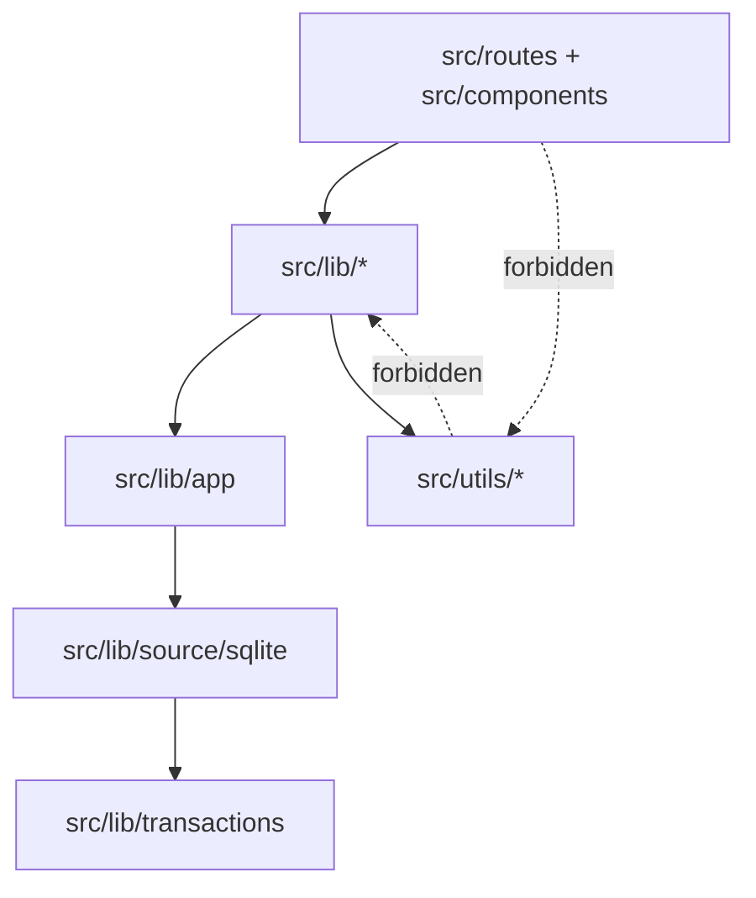
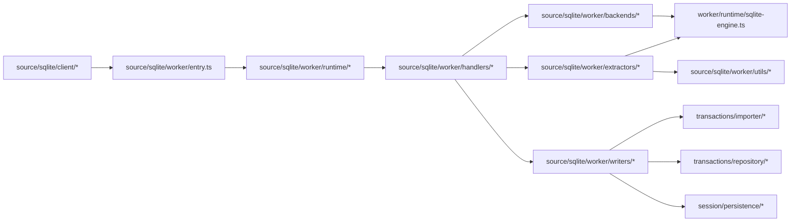
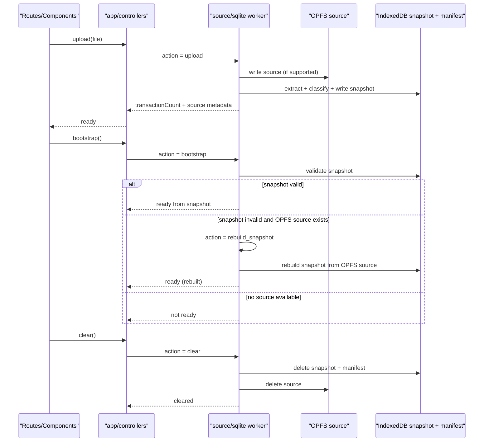

# Architecture

## Goal

SQLite parsing always runs in a worker. IndexedDB snapshot is the runtime
read model. Application controllers orchestrate the workflow.

## Module Boundaries

```text
src/lib/
  apis/             # bank APIs, pipelines, record APIs, SQLite client
  app/              # controllers, dashboard, filters, sessions, transaction utils
  charts/           # chart adapters, config, themes
  components/       # component class helpers, models
  currency/         # currency conversion, rates, models, store
  formatters/       # amount, category, date, transaction-type formatters
  loggers/          # logger models, constants
  notifications/    # notification models and store
  providers/        # storage providers (async storage, IndexedDB, OPFS)
  session/          # session models and persistence
  source/sqlite/    # worker client/protocol/runtime/backends/extractors/writers
  themes/           # theme constants, models, state, store
  transactions/     # classifier, importer, repository, models
  types/            # core shared types
  ui/               # UI exports (charts, notifications, themes)
  utils/            # utility aggregators

src/utils/
  db/
  apis/
  states/
  stores/
  types/
```

## Responsibility Map

- `app/`: orchestrates workflow state via controllers and exposes app APIs.
- `apis/`: bank APIs, pipeline definitions, record APIs, SQLite client.
- `source/sqlite/`: source ingestion engine and worker protocol.
- `transactions/`: transaction classification, filtering, and snapshot persistence.
- `session/`: session models and manifest persistence.
- `utils/`: generic platform primitives, imported only by `src/lib` and `src/utils`.

## Dependency Direction

Allowed:

1. `src/components` | `src/routes` → `src/lib`
2. `src/lib/app` → `src/lib/apis`, `src/lib/session`, `src/lib/source/sqlite`, `src/lib/transactions`
3. `src/lib/source/sqlite` → `src/lib/transactions` and its own worker internals
4. `src/lib/*` → `src/utils/*`

Disallowed:

- `src/components` | `src/routes` → `src/utils/*`
- `src/utils/*` → `src/lib/*`

## Runtime Workflow

1. User uploads SQLite file.
2. `app/controllers/sessionController.ts` sends worker request (`upload`).
3. Worker imports source (OPFS preferred), parses/extracts/classifies in batches.
4. Worker writes snapshot to IndexedDB and manifest.
5. Reopen uses `bootstrap` to load snapshot status and avoid direct SQLite query.
6. Invalid snapshot + OPFS source triggers worker rebuild.
7. Clear removes snapshot + manifest + OPFS source.

---

## Directory Dependency Diagrams

### High-Level Dependency Links



### source/sqlite Internal Links



### Storage + Runtime Workflow



---

## Storage Model

### Stores

Primary IndexedDB database: `moneywiz-ledger-v2`

Object stores:

- `session_manifest_v2` (`key: 'current'`)
- `ledger_transactions_v2` (parsed transaction snapshot)
- `ledger_meta_v2` (snapshot metadata)

### Source of Truth

- SQLite file in OPFS (preferred backend) is the durable source for rebuild.
- IndexedDB snapshot is the query/read model for UI.

### Backend Contract

- `opfs` backend:
  - upload imports source into OPFS and builds snapshot
  - refresh reads snapshot; rebuild allowed if snapshot invalid
  - clear removes both snapshot and OPFS source

- `snapshot` backend fallback:
  - upload parses from uploaded file in worker memory
  - refresh reads snapshot only
  - rebuild is not available without OPFS source

### Refresh Behavior

On reopen:

1. App checks snapshot validity.
2. If valid → load from snapshot only.
3. If invalid + OPFS source available → rebuild snapshot.
4. Else → idle and request re-upload.

---

## File Splitting Standard

### Hard Rule

- All non-test source files in `src/lib` and `src/utils` must be `<= 300` LOC.
- Proactive split target is `~220` LOC.

### Required Pattern

For multi-operation concerns, use folder split with aggregator:

```text
feature/
  apis/
    index.ts
    upload.ts
    clear.ts
    bootstrap.ts
```

Rules:

1. `index.ts` is the only re-export barrel.
2. Implementation files are single-responsibility and not barrels.
3. Prefer one primary exported unit per file.

### Naming Guidance

- Avoid monolith names like `apis.ts`, `state.ts`, `store.ts` when there are
  multiple operations.
- Prefer `apis/index.ts` with per-operation files.

### Exceptions

- Generated files or protocol type maps may exceed 300 LOC only when splitting
  harms correctness.
- Exception must include top-of-file comment header:

```ts
// LOC_EXEMPT: generated
```

or

```ts
// LOC_EXEMPT: protocol
```

### Enforcement

- Run `bun run check:loc`.
- CI should fail on files above 300 LOC without exemption.

---

## Notes

- SQLite parsing and extraction run only in worker thread.
- Reopen path reads from IndexedDB snapshot first, not raw SQLite query.
- Clear always removes both snapshot (IndexedDB) and source (OPFS).
- System assumes one active source database at a time.
