# Data Schema

Combined reference for SQLite schema, data parser rules, and SQL queries.

---

Source: local MoneyWiz SQLite export (private, not committed to repository).

## Notes

- This is a Core Data style database.
- `Z_PRIMARYKEY` maps entity ids (`Z_ENT`) to logical model names.
- Most relationships are not declared as SQLite foreign keys.
- `ZSYNCOBJECT` is a polymorphic table (329 columns) that stores many
  entity subtypes (Account, Budget, Category, Transaction, Tag, etc.).
- Relationship labels below are inferred from column names and
  `Z_PRIMARYKEY` entity mappings.

## Mermaid ER Diagram

```mermaid
erDiagram
  Z_PRIMARYKEY {
    INTEGER Z_ENT PK
    VARCHAR Z_NAME
    INTEGER Z_SUPER
    INTEGER Z_MAX
  }

  ZSYNCOBJECT {
    INTEGER Z_PK PK
    INTEGER Z_ENT
    INTEGER Z_OPT
    VARCHAR ZGID
    VARCHAR ZNAME
    FLOAT ZBALANCE
    TIMESTAMP ZDATE
    VARCHAR Z__MANY_OTHER_COLUMNS
  }

  ZACCOUNTBUDGETLINK {
    INTEGER Z_PK PK
    INTEGER Z_ENT
    INTEGER ZACCOUNT
    INTEGER Z9_ACCOUNT
    INTEGER ZBUDGET
  }

  ZCATEGORYASSIGMENT {
    INTEGER Z_PK PK
    INTEGER Z_ENT
    INTEGER ZBUDGET
    INTEGER ZCATEGORY
    INTEGER ZSCHEDULEDTRANSACITION
    INTEGER Z31_SCHEDULEDTRANSACITION
    INTEGER ZSTRINGHISTORYITEM
    INTEGER ZTRANSACTION
    INTEGER Z36_TRANSACTION
    FLOAT ZAMOUNT
  }

  ZCOMMONSETTINGS {
    INTEGER Z_PK PK
    INTEGER Z_ENT
    INTEGER ZCURRENTUSER
  }

  ZIMAGE {
    INTEGER Z_PK PK
    INTEGER Z_ENT
    INTEGER ZTRANSACTION
    INTEGER Z36_TRANSACTION
    VARCHAR ZIMAGEURLSTR
  }

  ZINVESTMENTACCOUNTTOTALVALUE {
    INTEGER Z_PK PK
    INTEGER Z_ENT
    INTEGER ZINVESTMENTACCOUNT
    INTEGER Z15_INVESTMENTACCOUNT
    TIMESTAMP ZDATE
    FLOAT ZCASHVALUE
    FLOAT ZHOLDINGSVALUE
  }

  ZSTRINGHISTORYITEM {
    INTEGER Z_PK PK
    INTEGER Z_ENT
    INTEGER ZPAYEE
    TIMESTAMP ZDATE
    VARCHAR ZSTRING
  }

  ZSYNCCOMMAND {
    INTEGER Z_PK PK
    INTEGER Z_ENT
    INTEGER ZUSER
    INTEGER ZOBJECTTYPE
    INTEGER ZREVISION
    VARCHAR ZOBJECTGID
  }

  ZTRANSACTIONBUDGETLINK {
    INTEGER Z_PK PK
    INTEGER Z_ENT
    INTEGER ZBUDGET
    INTEGER ZPASTPERIODSBUDGET
    INTEGER ZTRANSACTION
    INTEGER Z36_TRANSACTION
    INTEGER ZTRANSFERTRANSACTION
  }

  ZUSER {
    INTEGER Z_PK PK
    INTEGER Z_ENT
    INTEGER ZAPPSETTINGS
    INTEGER ZREVERSECOMMONSETTINGSCURRENTUSER
    INTEGER ZSYNCUSERID
  }

  ZWITHDRAWREFUNDTRANSACTIONLINK {
    INTEGER Z_PK PK
    INTEGER Z_ENT
    INTEGER ZREFUNDTRANSACTION
    INTEGER ZWITHDRAWTRANSACTION
  }

  Z_9INFOCARDS {
    INTEGER Z_9ACCOUNTS PK
    INTEGER Z_23INFOCARDS PK
  }

  Z_18INFOCARDS {
    INTEGER Z_18BUDGETS PK
    INTEGER Z_23INFOCARDS1 PK
  }

  Z_19INFOCARDS {
    INTEGER Z_19CATEGORIES PK
    INTEGER Z_23INFOCARDS2 PK
  }

  Z_23PAYEES {
    INTEGER Z_23INFOCARDS3 PK
    INTEGER Z_28PAYEES PK
  }

  Z_23SCHEDULEDTRANSACTIONS {
    INTEGER Z_23INFOCARDS4 PK
    INTEGER Z_31SCHEDULEDTRANSACTIONS PK
  }

  Z_23TAGS {
    INTEGER Z_23INFOCARDS5 PK
    INTEGER Z_35TAGS1 PK
  }

  Z_31TAGS {
    INTEGER Z_31SCHEDULEDTRANSACTIONS1 PK
    INTEGER Z_35TAGS2 PK
  }

  Z_36TAGS {
    INTEGER Z_36TRANSACTIONS PK
    INTEGER Z_35TAGS PK
  }

  Z_METADATA {
    INTEGER Z_VERSION PK
    VARCHAR Z_UUID
    BLOB Z_PLIST
  }

  Z_MODELCACHE {
    BLOB Z_CONTENT
  }

  Z_PRIMARYKEY ||--o{ ZSYNCOBJECT : "Z_ENT"
  Z_PRIMARYKEY ||--o{ ZACCOUNTBUDGETLINK : "Z_ENT"
  Z_PRIMARYKEY ||--o{ ZCATEGORYASSIGMENT : "Z_ENT"
  Z_PRIMARYKEY ||--o{ ZCOMMONSETTINGS : "Z_ENT"
  Z_PRIMARYKEY ||--o{ ZIMAGE : "Z_ENT"
  Z_PRIMARYKEY ||--o{ ZINVESTMENTACCOUNTTOTALVALUE : "Z_ENT"
  Z_PRIMARYKEY ||--o{ ZSTRINGHISTORYITEM : "Z_ENT"
  Z_PRIMARYKEY ||--o{ ZSYNCCOMMAND : "Z_ENT"
  Z_PRIMARYKEY ||--o{ ZTRANSACTIONBUDGETLINK : "Z_ENT"
  Z_PRIMARYKEY ||--o{ ZUSER : "Z_ENT"
  Z_PRIMARYKEY ||--o{ ZWITHDRAWREFUNDTRANSACTIONLINK : "Z_ENT"

  ZACCOUNTBUDGETLINK }o--|| ZSYNCOBJECT : "ZACCOUNT -> Account(9)"
  ZACCOUNTBUDGETLINK }o--|| ZSYNCOBJECT : "ZBUDGET -> Budget(18)"

  ZCATEGORYASSIGMENT }o--|| ZSYNCOBJECT : "ZBUDGET -> Budget(18)"
  ZCATEGORYASSIGMENT }o--|| ZSYNCOBJECT : "ZCATEGORY -> Category(19)"
  ZCATEGORYASSIGMENT }o--|| ZSYNCOBJECT : "ZSCHEDULEDTRANSACITION -> ScheduledTransactionHandler(31)"
  ZCATEGORYASSIGMENT }o--|| ZSYNCOBJECT : "ZTRANSACTION -> Transaction(36)"
  ZCATEGORYASSIGMENT }o--|| ZSTRINGHISTORYITEM : "ZSTRINGHISTORYITEM"

  ZCOMMONSETTINGS }o--|| ZUSER : "ZCURRENTUSER"

  ZIMAGE }o--|| ZSYNCOBJECT : "ZTRANSACTION -> Transaction(36)"

  ZINVESTMENTACCOUNTTOTALVALUE }o--|| ZSYNCOBJECT : "ZINVESTMENTACCOUNT -> InvestmentAccount(15)"

  ZSTRINGHISTORYITEM }o--|| ZSYNCOBJECT : "ZPAYEE -> Payee(28)"

  ZSYNCCOMMAND }o--|| ZUSER : "ZUSER"

  ZTRANSACTIONBUDGETLINK }o--|| ZSYNCOBJECT : "ZBUDGET -> Budget(18)"
  ZTRANSACTIONBUDGETLINK }o--|| ZSYNCOBJECT : "ZTRANSACTION -> Transaction(36)"
  ZTRANSACTIONBUDGETLINK }o--|| ZSYNCOBJECT : "ZTRANSFERTRANSACTION -> Transaction(36 family)"

  ZUSER }o--|| ZSYNCOBJECT : "ZAPPSETTINGS -> AppSettings(17)"

  ZWITHDRAWREFUNDTRANSACTIONLINK }o--|| ZSYNCOBJECT : "ZREFUNDTRANSACTION -> RefundTransaction(43)"
  ZWITHDRAWREFUNDTRANSACTIONLINK }o--|| ZSYNCOBJECT : "ZWITHDRAWTRANSACTION -> WithdrawTransaction(47)"

  Z_9INFOCARDS }o--|| ZSYNCOBJECT : "Z_9ACCOUNTS -> Account(9)"
  Z_9INFOCARDS }o--|| ZSYNCOBJECT : "Z_23INFOCARDS -> InfoCard(23)"

  Z_18INFOCARDS }o--|| ZSYNCOBJECT : "Z_18BUDGETS -> Budget(18)"
  Z_18INFOCARDS }o--|| ZSYNCOBJECT : "Z_23INFOCARDS1 -> InfoCard(23)"

  Z_19INFOCARDS }o--|| ZSYNCOBJECT : "Z_19CATEGORIES -> Category(19)"
  Z_19INFOCARDS }o--|| ZSYNCOBJECT : "Z_23INFOCARDS2 -> InfoCard(23)"

  Z_23PAYEES }o--|| ZSYNCOBJECT : "Z_23INFOCARDS3 -> InfoCard(23)"
  Z_23PAYEES }o--|| ZSYNCOBJECT : "Z_28PAYEES -> Payee(28)"

  Z_23SCHEDULEDTRANSACTIONS }o--|| ZSYNCOBJECT : "Z_23INFOCARDS4 -> InfoCard(23)"
  Z_23SCHEDULEDTRANSACTIONS }o--|| ZSYNCOBJECT : "Z_31SCHEDULEDTRANSACTIONS -> ScheduledTransactionHandler(31)"

  Z_23TAGS }o--|| ZSYNCOBJECT : "Z_23INFOCARDS5 -> InfoCard(23)"
  Z_23TAGS }o--|| ZSYNCOBJECT : "Z_35TAGS1 -> Tag(35)"

  Z_31TAGS }o--|| ZSYNCOBJECT : "Z_31SCHEDULEDTRANSACTIONS1 -> ScheduledTransactionHandler(31)"
  Z_31TAGS }o--|| ZSYNCOBJECT : "Z_35TAGS2 -> Tag(35)"

  Z_36TAGS }o--|| ZSYNCOBJECT : "Z_36TRANSACTIONS -> Transaction(36)"
  Z_36TAGS }o--|| ZSYNCOBJECT : "Z_35TAGS -> Tag(35)"
```



## Entity Id Map (`Z_PRIMARYKEY`)

| Z_ENT | Z_NAME                              |
| ----- | ----------------------------------- |
| 1     | AccountBudgetLink                   |
| 2     | CategoryAssigment                   |
| 3     | CommonSettings                      |
| 4     | Image                               |
| 5     | InvestmentAccountTotalValue         |
| 6     | StringHistoryItem                   |
| 7     | SyncCommand                         |
| 8     | SyncObject                          |
| 9     | Account                             |
| 10    | BankChequeAccount                   |
| 11    | BankSavingAccount                   |
| 12    | CashAccount                         |
| 13    | CreditCardAccount                   |
| 14    | LoanAccount                         |
| 15    | InvestmentAccount                   |
| 16    | ForexAccount                        |
| 17    | AppSettings                         |
| 18    | Budget                              |
| 19    | Category                            |
| 20    | CustomFormsOption                   |
| 21    | CustomReport                        |
| 22    | Group                               |
| 23    | InfoCard                            |
| 24    | InvestmentHolding                   |
| 25    | OnlineBank                          |
| 26    | OnlineBankAccount                   |
| 27    | OnlineBankUser                      |
| 28    | Payee                               |
| 29    | PaymentPlan                         |
| 30    | PaymentPlanItem                     |
| 31    | ScheduledTransactionHandler         |
| 32    | ScheduledDepositTransactionHandler  |
| 33    | ScheduledTransferTransactionHandler |
| 34    | ScheduledWithdrawTransactionHandler |
| 35    | Tag                                 |
| 36    | Transaction                         |
| 37    | DepositTransaction                  |
| 38    | InvestmentExchangeTransaction       |
| 39    | InvestmentTransaction               |
| 40    | InvestmentBuyTransaction            |
| 41    | InvestmentSellTransaction           |
| 42    | ReconcileTransaction                |
| 43    | RefundTransaction                   |
| 44    | TransferBudgetTransaction           |
| 45    | TransferDepositTransaction          |
| 46    | TransferWithdrawTransaction         |
| 47    | WithdrawTransaction                 |
| 48    | TransactionBudgetLink               |
| 49    | User                                |
| 50    | WithdrawRefundTransactionLink       |

---

- [1. SQLite Import Rules](#1-sqlite-import-rules)
  - [1.1 File Loading](#11-file-loading)
  - [1.2 Database Structure](#12-database-structure)
  - [1.3 Entity Type Mapping](#13-entity-type-mapping)
  - [1.4 Field Conversion](#14-field-conversion)
    - [Date Conversion](#date-conversion)
    - [Amount Conversion](#amount-conversion)
    - [Analytics Currency Normalization](#analytics-currency-normalization)
    - [Category Conversion](#category-conversion)
    - [Account Type Mapping](#account-type-mapping)
    - [Tag Conversion](#tag-conversion)
  - [1.5 Transaction Classification](#15-transaction-classification)
- [2. Filter Chain (Applied in UI)](#2-filter-chain-applied-in-ui)
  - [Tag Filter Logic](#tag-filter-logic)
  - [Category Filter Logic](#category-filter-logic)
- [3. Special Category Handling](#3-special-category-handling)
- [4. Category Tree Structure](#4-category-tree-structure)

## 1. SQLite Import Rules

### 1.1 File Loading

The SQLite file is loaded in the browser using `@sqlite.org/sqlite-wasm`:

1. **Read file**: Read as `ArrayBuffer`
2. **WAL patch**: If header bytes 18-19 indicate WAL mode, patch to legacy
3. **Deserialize**: Load into in-memory SQLite via `sqlite3_deserialize`
4. **Lookup tables**: Parse `Z_PRIMARYKEY` for entity name mapping
5. **Extract data**: Parse accounts, payees, categories, tags, users
6. **Build relations**: Map categories and tags to transactions
7. **Parse transactions**: Convert `ZSYNCOBJECT` rows to `SQLiteTransaction`

### 1.2 Database Structure

MoneyWiz uses a Core Data SQLite schema with:

- **`Z_PRIMARYKEY`**: Maps entity IDs (`Z_ENT`) to logical model names
- **`ZSYNCOBJECT`**: Polymorphic table storing all entity subtypes
- **`ZCATEGORYASSIGMENT`**: Links transactions to categories
- **`Z_36TAGS`**: Links transactions to tags

See the [Mermaid ER Diagram](#mermaid-er-diagram) section above for the full schema.

### 1.3 Entity Type Mapping

SQLite entity names map to transaction entity types:

| Entity Name                   | Z_ENT | Role                 |
| ----------------------------- | ----- | -------------------- |
| `DepositTransaction`          | 37    | Income/Refund        |
| `WithdrawTransaction`         | 47    | Expense              |
| `TransferDepositTransaction`  | 45    | Transfer (receiving) |
| `TransferWithdrawTransaction` | 46    | Transfer (sending)   |
| `TransferBudgetTransaction`   | 44    | Transfer (budget)    |
| `InvestmentBuyTransaction`    | 40    | Buy                  |
| `InvestmentSellTransaction`   | 41    | Sell                 |
| `ReconcileTransaction`        | 42    | Reconcile            |
| `RefundTransaction`           | 43    | Refund               |

### 1.4 Field Conversion

#### Date Conversion

- **Source**: Core Data timestamp (seconds since 2001-01-01 00:00:00 UTC)
- **Conversion**: `new Date(APPLE_REFERENCE_EPOCH_MS + timestamp * 1000)`
- **Output**: JavaScript `Date`
- **Missing date**: Returns `new Date(0)`

#### Amount Conversion

- **Source**: `ZAMOUNT` / `ZAMOUNT1` numeric columns
- **Output**: `{ value: number, currency: string }`
- **Default currency**: `THB` if not available from account or transaction
- **Missing amount**: Returns `0`
- **Analytics normalization target**: `THB` (historical conversion at transaction date)

#### Analytics Currency Normalization

Analytics values are normalized to THB with this priority:

1. **Exact raw THB amount**: When transaction raw data includes both
   `amount` (THB) and `originalAmount` (foreign), and magnitudes differ,
   use raw `amount` directly.
2. **Historical date rate**: For remaining non-THB values, convert using
   historical FX near the transaction date (same day or nearest prior
   market day).
3. **Unresolved fallback**: If no rate can be resolved, the transaction is
   excluded from analytics totals and surfaced in warning metadata.

Historical rates are cached in local storage-backed state to avoid
refetching during filter/tab interactions.

#### Category Conversion

- **Source**: `ZCATEGORYASSIGMENT` join table → `SQLiteCategoryRef`
- **Format**: `parentName > name` (when parent exists)
- **Output**: `{ category: string, subcategory: string }`
- **No categories**: Empty string (treated as no category)

#### Account Type Mapping

Account types are derived from the SQLite entity ID of the account:

| Entity Name         | Z_ENT | Account Type |
| ------------------- | ----- | ------------ |
| `CashAccount`       | 12    | Wallet       |
| `BankChequeAccount` | 10    | Checking     |
| `BankSavingAccount` | 11    | Checking     |
| `CreditCardAccount` | 13    | CreditCard   |
| `LoanAccount`       | 14    | Loan         |
| `InvestmentAccount` | 15    | Investment   |
| `ForexAccount`      | 16    | Unknown      |

#### Tag Conversion

- **Source**: `Z_36TAGS` join table → `SQLiteTagRef`
- **Output**: `Array<{ category: string, name: string }>`
- **Category**: Parsed from tag name via `"Category: Name"` encoding (e.g. `"Group: KcNt"` → `{ category: 'Group', name: 'KcNt' }`)
- **Alias**: `Zvent` is mapped to `Event` by `parseTag()`
- **No category**: Tags without `": "` separator get `category: ""` and are excluded from filter grouping

### 1.5 Transaction Classification

**Pre-import filtering:**

- Transactions with no category and a description matching "new balance"
  (case-insensitive) are excluded during import and never reach
  classification.
- Transactions classified as `Income` or `Expense` with missing payee or
  missing category are excluded during import (legacy incomplete records).

Transactions are classified in this priority order:

| Priority | Condition                                                                       | Type                            |
| -------- | ------------------------------------------------------------------------------- | ------------------------------- |
| 1        | Category = `Other Expenses > Debt`                                              | `Debt`                          |
| 2        | Category = `Other Incomes > Debt Repayment`                                     | `DebtRepayment`                 |
| 3        | Category = `Other Incomes > Windfall`                                           | `Windfall`                      |
| 4        | Category = `Other Expenses > Giveaways`                                         | `Giveaway`                      |
| 5        | Entity = `ReconcileTransaction` (42)                                            | `Reconcile`                     |
| 6        | Entity is Transfer type AND `Category` filled                                   | `Income` / `Expense` / `Refund` |
| 7        | Entity is Transfer type AND `Category` empty                                    | `Transfer`                      |
| 8        | Entity = `RefundTransaction` (43)                                               | `Refund`                        |
| 9        | Entity = `InvestmentBuyTransaction` (40)                                        | `Buy`                           |
| 10       | Entity = `InvestmentSellTransaction` (41)                                       | `Sell`                          |
| 11       | Account = Investment AND `Category` empty AND `Amount > 0`                      | `Sell`                          |
| 12       | Account = Investment AND `Category` empty AND `Amount < 0`                      | `Buy`                           |
| 13       | `Amount > 0` AND category parent is in income prefixes                          | `Income`                        |
| 14       | `Amount < 0`                                                                    | `Expense`                       |
| 15       | `Category` filled AND category parent NOT in income prefixes AND no prior match | `Refund`                        |
| 16       | No prior match                                                                  | `Unknown`                       |

**Income category prefixes:**

- `Compensation`
- `Other Incomes`

## 2. Filter Chain (Applied in UI)

In `src/routes/+page.svelte`, filters are applied in this order when selected:

1. Date range (`byDateRange`)
2. Transaction type include filter (`byTransactionType`)
3. Category include filter (`byCategory` with `mode: 'include'`)
4. Tag filters (`byTags`)

### Tag Filter Logic

- Multiple tag categories use **AND** logic
- Values inside one tag category use **OR** logic
- Mode per category: `include` or `exclude`

### Category Filter Logic

- `byCategory` supports both `include` and `exclude`
- Current page UI applies it in `include` mode
- Matching includes exact category and descendants (`Parent > Child`)

## 3. Special Category Handling

Special categories are classified first and get dedicated transaction types:

| Category                         | Type            |
| -------------------------------- | --------------- |
| `Other Expenses > Debt`          | `Debt`          |
| `Other Incomes > Debt Repayment` | `DebtRepayment` |
| `Other Expenses > Giveaways`     | `Giveaway`      |
| `Other Incomes > Windfall`       | `Windfall`      |

These are not globally auto-excluded by default filtering. They are surfaced
as separate totals in summary/time-series transforms.

## 4. Category Tree Structure

Category trees are built per transaction type (`Expense` and `Income` only):

- Transactions without categories are skipped
- Child label defaults to `(uncategorized)` when empty
- Parent total = sum of child absolute amounts
- Parent percentage = parent total / grand total
- Child percentage = child total / parent total

Refunds are not part of the category tree because the tree is built only from
`Expense` or `Income` transaction types.

---

This document defines SQL for monthly net worth with these requirements:

1. Ignore current month (incomplete month)
2. Output `start_balance`, `changed`, `end_balance`
3. Provide two statements:
   - Total net worth
   - Specific account

Investment behavior:

- Buy/Sell in investment accounts is cash <-> asset conversion, not direct
  net worth gain/loss.
- Investment balance should come from
  `ZINVESTMENTACCOUNTTOTALVALUE` (`cash + holdings`), not Buy/Sell sums.

## Shared Rules

- Account rows: `ZSYNCOBJECT` with `Z_ENT BETWEEN 10 AND 16`
- Non-investment accounts: `Z_ENT != 15`
- Investment accounts: `Z_ENT = 15`
- Loan accounts are excluded from net worth: `Z_ENT != 14`
- Transaction datetime conversion:
  `datetime(core_data_seconds + 978307200, 'unixepoch')`
- Month bucket:
  `date(..., 'start of month', '+1 month', '-1 day')`
- Current month ignored using:
  `date('now', 'start of month', '-1 day')`

## 1) SQL: Total Net Worth per Month

Output columns per month:

- `month_end`
- `start_balance` (total net worth at start of month)
- `changed` (net change in month)
- `end_balance` (total net worth at end of month)

```sql
WITH RECURSIVE
params AS (
	SELECT date('now', 'start of month', '-1 day') AS last_complete_month_end
),
accounts AS (
	SELECT
		a.Z_PK AS account_id,
		a.Z_ENT AS account_ent,
		COALESCE(
			a.ZNAME, a.ZNAME1, a.ZNAME2, a.ZNAME3, a.ZNAME4, a.ZNAME5, a.ZNAME6,
			'Account #' || a.Z_PK
		) AS account_name,
		COALESCE(a.ZOPENINGBALANCE, a.ZOPENINGBALANCE1, 0) AS opening_balance
	FROM ZSYNCOBJECT a
	WHERE a.Z_ENT BETWEEN 10 AND 16
		AND a.Z_ENT != 14
),
transaction_rows AS (
	SELECT
		COALESCE(t.ZDATE1, t.ZDATE) AS tx_coredata_sec,
		COALESCE(t.ZAMOUNT1, t.ZAMOUNT, 0) AS tx_amount,
		COALESCE(t.ZACCOUNT2, t.ZACCOUNT1, t.ZACCOUNT) AS account_id,
		COALESCE(t.ZSENDERACCOUNT, t.Z9_SENDERACCOUNT) AS sender_account_id,
		COALESCE(
			t.ZRECIPIENTACCOUNT1,
			t.ZRECIPIENTACCOUNT,
			t.Z9_RECIPIENTACCOUNT1,
			t.Z9_RECIPIENTACCOUNT
		) AS recipient_account_id
	FROM ZSYNCOBJECT t
	JOIN Z_PRIMARYKEY pk ON pk.Z_ENT = t.Z_ENT
	WHERE pk.Z_NAME LIKE '%Transaction'
		AND pk.Z_NAME NOT LIKE 'Scheduled%'
		AND COALESCE(t.ZDATE1, t.ZDATE) IS NOT NULL
),
transaction_legs AS (
	SELECT
		date(
			datetime(tx_coredata_sec + 978307200, 'unixepoch'),
			'start of month', '+1 month', '-1 day'
		) AS month_end,
		sender_account_id AS account_id,
		-abs(tx_amount) AS signed_amount
	FROM transaction_rows
	WHERE sender_account_id IS NOT NULL
		AND recipient_account_id IS NOT NULL

	UNION ALL

	SELECT
		date(
			datetime(tx_coredata_sec + 978307200, 'unixepoch'),
			'start of month', '+1 month', '-1 day'
		) AS month_end,
		recipient_account_id AS account_id,
		abs(tx_amount) AS signed_amount
	FROM transaction_rows
	WHERE sender_account_id IS NOT NULL
		AND recipient_account_id IS NOT NULL

	UNION ALL

	SELECT
		date(
			datetime(tx_coredata_sec + 978307200, 'unixepoch'),
			'start of month', '+1 month', '-1 day'
		) AS month_end,
		account_id,
		tx_amount AS signed_amount
	FROM transaction_rows
	WHERE NOT (sender_account_id IS NOT NULL AND recipient_account_id IS NOT NULL)
		AND account_id IS NOT NULL
),
non_investment_monthly_change AS (
	SELECT
		l.month_end,
		l.account_id,
		SUM(l.signed_amount) AS changed
	FROM transaction_legs l
	JOIN accounts a ON a.account_id = l.account_id
	WHERE a.account_ent != 15
	GROUP BY l.month_end, l.account_id
),
investment_snapshot_base AS (
	SELECT
		date(
			datetime(v.ZDATE + 978307200, 'unixepoch'),
			'start of month', '+1 month', '-1 day'
		) AS month_end,
		COALESCE(v.ZINVESTMENTACCOUNT, v.Z15_INVESTMENTACCOUNT) AS account_id,
		COALESCE(v.ZCASHVALUE, 0) + COALESCE(v.ZHOLDINGSVALUE, 0) AS total_value,
		datetime(v.ZDATE + 978307200, 'unixepoch') AS snapshot_ts
	FROM ZINVESTMENTACCOUNTTOTALVALUE v
	WHERE COALESCE(v.ZINVESTMENTACCOUNT, v.Z15_INVESTMENTACCOUNT) IS NOT NULL
		AND v.ZDATE IS NOT NULL
),
investment_snapshot_monthly AS (
	SELECT
		b.month_end,
		b.account_id,
		b.total_value
	FROM investment_snapshot_base b
	JOIN (
		SELECT month_end, account_id, MAX(snapshot_ts) AS max_snapshot_ts
		FROM investment_snapshot_base
		GROUP BY month_end, account_id
	) picked
		ON picked.month_end = b.month_end
		AND picked.account_id = b.account_id
		AND picked.max_snapshot_ts = b.snapshot_ts
),
min_month_source AS (
	SELECT MIN(month_end) AS min_month_end
	FROM (
		SELECT month_end FROM non_investment_monthly_change
		UNION ALL
		SELECT month_end FROM investment_snapshot_monthly
	)
),
months(month_end) AS (
	SELECT min_month_end FROM min_month_source
	UNION ALL
	SELECT date(month_end, 'start of month', '+2 month', '-1 day')
	FROM months, params
	WHERE month_end < params.last_complete_month_end
),
account_month_grid AS (
	SELECT
		m.month_end,
		a.account_id,
		a.account_ent,
		a.account_name,
		a.opening_balance
	FROM months m
	CROSS JOIN accounts a
	JOIN params p ON 1 = 1
	WHERE m.month_end <= p.last_complete_month_end
),
non_investment_balances AS (
	SELECT
		g.month_end,
		g.account_id,
		g.account_name,
		COALESCE(
			g.opening_balance + SUM(COALESCE(c.changed, 0)) OVER (
				PARTITION BY g.account_id
				ORDER BY g.month_end
				ROWS BETWEEN UNBOUNDED PRECEDING AND 1 PRECEDING
			),
			g.opening_balance
		) AS start_balance,
		COALESCE(c.changed, 0) AS changed,
		g.opening_balance + SUM(COALESCE(c.changed, 0)) OVER (
			PARTITION BY g.account_id
			ORDER BY g.month_end
			ROWS BETWEEN UNBOUNDED PRECEDING AND CURRENT ROW
		) AS end_balance
	FROM account_month_grid g
	LEFT JOIN non_investment_monthly_change c
		ON c.account_id = g.account_id
		AND c.month_end = g.month_end
	WHERE g.account_ent != 15
),
investment_balances AS (
	SELECT
		g.month_end,
		g.account_id,
		g.account_name,
		LAG(
			COALESCE((
				SELECT s.total_value
				FROM investment_snapshot_monthly s
				WHERE s.account_id = g.account_id
					AND s.month_end <= g.month_end
				ORDER BY s.month_end DESC
				LIMIT 1
			), g.opening_balance),
			1,
			g.opening_balance
		) OVER (
			PARTITION BY g.account_id
			ORDER BY g.month_end
		) AS start_balance,
		COALESCE((
			SELECT s.total_value
			FROM investment_snapshot_monthly s
			WHERE s.account_id = g.account_id
				AND s.month_end <= g.month_end
			ORDER BY s.month_end DESC
			LIMIT 1
		), g.opening_balance)
		- LAG(
			COALESCE((
				SELECT s2.total_value
				FROM investment_snapshot_monthly s2
				WHERE s2.account_id = g.account_id
					AND s2.month_end <= g.month_end
				ORDER BY s2.month_end DESC
				LIMIT 1
			), g.opening_balance),
			1,
			g.opening_balance
		) OVER (
			PARTITION BY g.account_id
			ORDER BY g.month_end
		) AS changed,
		COALESCE((
			SELECT s.total_value
			FROM investment_snapshot_monthly s
			WHERE s.account_id = g.account_id
				AND s.month_end <= g.month_end
			ORDER BY s.month_end DESC
			LIMIT 1
		), g.opening_balance) AS end_balance
	FROM account_month_grid g
	WHERE g.account_ent = 15
),
all_account_balances AS (
	SELECT month_end, account_id, account_name, start_balance, changed, end_balance
	FROM non_investment_balances
	UNION ALL
	SELECT month_end, account_id, account_name, start_balance, changed, end_balance
	FROM investment_balances
)
SELECT
	month_end,
	ROUND(SUM(start_balance), 2) AS start_balance,
	ROUND(SUM(changed), 2) AS changed,
	ROUND(SUM(end_balance), 2) AS end_balance
FROM all_account_balances
GROUP BY month_end
ORDER BY month_end
```

## 2) SQL: Monthly Balance for One Specific Account

Set `target_account` to your account id.

Output columns:

- `month_end`
- `account_id`
- `account_name`
- `start_balance`
- `changed`
- `end_balance`

```sql
WITH RECURSIVE
params AS (
	SELECT
		date('now', 'start of month', '-1 day') AS last_complete_month_end,
		751 AS target_account
),
account_pick AS (
	SELECT
		a.Z_PK AS account_id,
		a.Z_ENT AS account_ent,
		COALESCE(
			a.ZNAME, a.ZNAME1, a.ZNAME2, a.ZNAME3, a.ZNAME4, a.ZNAME5, a.ZNAME6,
			'Account #' || a.Z_PK
		) AS account_name,
		COALESCE(a.ZOPENINGBALANCE, a.ZOPENINGBALANCE1, 0) AS opening_balance
	FROM ZSYNCOBJECT a
	JOIN params p ON p.target_account = a.Z_PK
	WHERE a.Z_ENT BETWEEN 10 AND 16
		AND a.Z_ENT != 14
),
transaction_rows AS (
	SELECT
		COALESCE(t.ZDATE1, t.ZDATE) AS tx_coredata_sec,
		COALESCE(t.ZAMOUNT1, t.ZAMOUNT, 0) AS tx_amount,
		COALESCE(t.ZACCOUNT2, t.ZACCOUNT1, t.ZACCOUNT) AS account_id,
		COALESCE(t.ZSENDERACCOUNT, t.Z9_SENDERACCOUNT) AS sender_account_id,
		COALESCE(
			t.ZRECIPIENTACCOUNT1,
			t.ZRECIPIENTACCOUNT,
			t.Z9_RECIPIENTACCOUNT1,
			t.Z9_RECIPIENTACCOUNT
		) AS recipient_account_id
	FROM ZSYNCOBJECT t
	JOIN Z_PRIMARYKEY pk ON pk.Z_ENT = t.Z_ENT
	WHERE pk.Z_NAME LIKE '%Transaction'
		AND pk.Z_NAME NOT LIKE 'Scheduled%'
		AND COALESCE(t.ZDATE1, t.ZDATE) IS NOT NULL
),
transaction_legs AS (
	SELECT
		date(
			datetime(tx_coredata_sec + 978307200, 'unixepoch'),
			'start of month', '+1 month', '-1 day'
		) AS month_end,
		sender_account_id AS account_id,
		-abs(tx_amount) AS signed_amount
	FROM transaction_rows
	WHERE sender_account_id IS NOT NULL
		AND recipient_account_id IS NOT NULL

	UNION ALL

	SELECT
		date(
			datetime(tx_coredata_sec + 978307200, 'unixepoch'),
			'start of month', '+1 month', '-1 day'
		) AS month_end,
		recipient_account_id AS account_id,
		abs(tx_amount) AS signed_amount
	FROM transaction_rows
	WHERE sender_account_id IS NOT NULL
		AND recipient_account_id IS NOT NULL

	UNION ALL

	SELECT
		date(
			datetime(tx_coredata_sec + 978307200, 'unixepoch'),
			'start of month', '+1 month', '-1 day'
		) AS month_end,
		account_id,
		tx_amount AS signed_amount
	FROM transaction_rows
	WHERE NOT (sender_account_id IS NOT NULL AND recipient_account_id IS NOT NULL)
		AND account_id IS NOT NULL
),
monthly_change AS (
	SELECT
		l.month_end,
		SUM(l.signed_amount) AS changed
	FROM transaction_legs l
	JOIN account_pick a ON a.account_id = l.account_id
	WHERE a.account_ent != 15
	GROUP BY l.month_end
),
investment_snapshot_base AS (
	SELECT
		date(
			datetime(v.ZDATE + 978307200, 'unixepoch'),
			'start of month', '+1 month', '-1 day'
		) AS month_end,
		COALESCE(v.ZINVESTMENTACCOUNT, v.Z15_INVESTMENTACCOUNT) AS account_id,
		COALESCE(v.ZCASHVALUE, 0) + COALESCE(v.ZHOLDINGSVALUE, 0) AS total_value,
		datetime(v.ZDATE + 978307200, 'unixepoch') AS snapshot_ts
	FROM ZINVESTMENTACCOUNTTOTALVALUE v
	WHERE COALESCE(v.ZINVESTMENTACCOUNT, v.Z15_INVESTMENTACCOUNT) IS NOT NULL
		AND v.ZDATE IS NOT NULL
),
investment_snapshot_monthly AS (
	SELECT
		b.month_end,
		b.account_id,
		b.total_value
	FROM investment_snapshot_base b
	JOIN (
		SELECT month_end, account_id, MAX(snapshot_ts) AS max_snapshot_ts
		FROM investment_snapshot_base
		GROUP BY month_end, account_id
	) picked
		ON picked.month_end = b.month_end
		AND picked.account_id = b.account_id
		AND picked.max_snapshot_ts = b.snapshot_ts
),
min_month_source AS (
	SELECT MIN(month_end) AS min_month_end
	FROM (
		SELECT month_end FROM monthly_change
		UNION ALL
		SELECT month_end
		FROM investment_snapshot_monthly s
		JOIN account_pick a ON a.account_id = s.account_id
	)
),
months(month_end) AS (
	SELECT min_month_end FROM min_month_source
	UNION ALL
	SELECT date(month_end, 'start of month', '+2 month', '-1 day')
	FROM months, params
	WHERE month_end < params.last_complete_month_end
)
SELECT
	m.month_end,
	a.account_id,
	a.account_name,
	ROUND(
		CASE
			WHEN a.account_ent = 15 THEN LAG(
				COALESCE((
					SELECT s.total_value
					FROM investment_snapshot_monthly s
					WHERE s.account_id = a.account_id
						AND s.month_end <= m.month_end
					ORDER BY s.month_end DESC
					LIMIT 1
				), a.opening_balance),
				1,
				a.opening_balance
			) OVER (ORDER BY m.month_end)
			ELSE COALESCE(
				a.opening_balance + SUM(COALESCE(c.changed, 0)) OVER (
					ORDER BY m.month_end
					ROWS BETWEEN UNBOUNDED PRECEDING AND 1 PRECEDING
				),
				a.opening_balance
			)
		END,
		2
	) AS start_balance,
	ROUND(
		CASE
			WHEN a.account_ent = 15 THEN COALESCE((
				SELECT s.total_value
				FROM investment_snapshot_monthly s
				WHERE s.account_id = a.account_id
					AND s.month_end <= m.month_end
				ORDER BY s.month_end DESC
				LIMIT 1
			), a.opening_balance) - LAG(
				COALESCE((
					SELECT s2.total_value
					FROM investment_snapshot_monthly s2
					WHERE s2.account_id = a.account_id
						AND s2.month_end <= m.month_end
					ORDER BY s2.month_end DESC
					LIMIT 1
				), a.opening_balance),
				1,
				a.opening_balance
			) OVER (ORDER BY m.month_end)
			ELSE COALESCE(c.changed, 0)
		END,
		2
	) AS changed,
	ROUND(
		CASE
			WHEN a.account_ent = 15 THEN COALESCE((
				SELECT s.total_value
				FROM investment_snapshot_monthly s
				WHERE s.account_id = a.account_id
					AND s.month_end <= m.month_end
				ORDER BY s.month_end DESC
				LIMIT 1
			), a.opening_balance)
			ELSE a.opening_balance + SUM(COALESCE(c.changed, 0)) OVER (
				ORDER BY m.month_end
				ROWS BETWEEN UNBOUNDED PRECEDING AND CURRENT ROW
			)
		END,
		2
	) AS end_balance
FROM months m
CROSS JOIN account_pick a
LEFT JOIN monthly_change c ON c.month_end = m.month_end
JOIN params p ON 1 = 1
WHERE m.month_end <= p.last_complete_month_end
ORDER BY m.month_end
```

## Notes

- If `ZINVESTMENTACCOUNTTOTALVALUE` has no rows, investment account output
  falls back to opening balance carry-forward.
- Replace `751` in `target_account` with the account id you want.
- If `target_account` is a loan account (`Z_ENT = 14`), the query returns no
  rows because loans are excluded from net worth.
