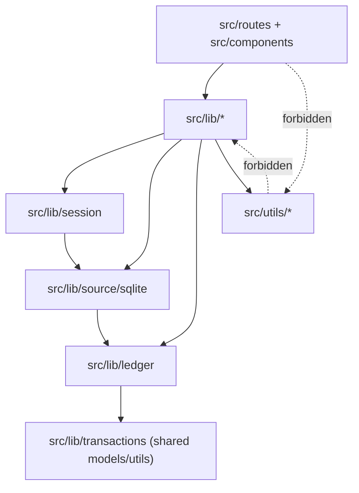
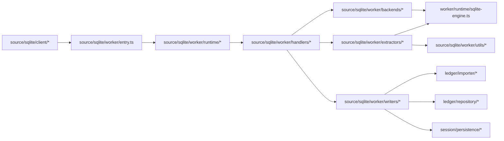
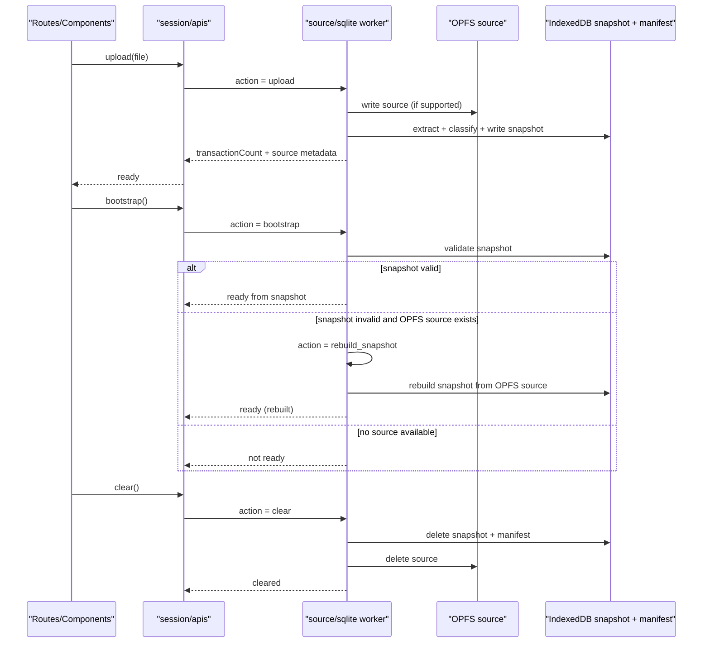

# Directory Link Diagram V2

## Purpose

This document shows how the new V2 directories depend on each other and
how data moves through upload, bootstrap, rebuild, and clear workflows.

## High-Level Dependency Links

## source/sqlite Internal Links

## Storage + Runtime Workflow

## Notes

- SQLite parsing and extraction run only in worker thread.
- Reopen path reads from IndexedDB snapshot first, not raw SQLite query.
- Clear always removes both snapshot (IndexedDB) and source (OPFS).
- System assumes one active source database at a time.
